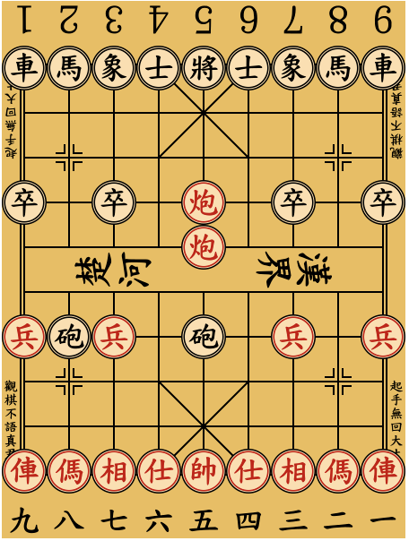

# Xiangqi

## Overview

[Xiangqi](https://en.wikipedia.org/wiki/Xiangqi), also known as Chinese Chess, is one of the most popular board games in China.

<figure align="center">
    
    <figcaption>Xiangqi (Chinese Chess)</figcaption>
</figure>

## Requirements

## Setup

## Directory Structure

## Group Members
+ Sihan Wei
+ Yilin Chen
+ Jiarui Wang

## Acknowledgement

+ Xiangqi pieces and board are from [Wj654cj86's work](https://commons.wikimedia.org/wiki/Category:Xiangqi_pieces).
